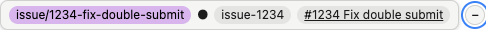

# marquee

`marquee -- bin/dev` starts your dev stack behind a transparent proxy on the port you already use, and every HTML page you load carries a small shadow-DOM bar telling you exactly which branch/worktree/PR you are looking at.

With git worktrees and coding agents in the mix, "which code is my browser actually showing?" is a real question. The answer belongs on the page, not in a terminal three windows away.

<!-- TODO(launch): demo GIF recorded against a small PUBLIC sample app — never an employer app -->



Click it to collapse down to a single dot:


**Status: pre-alpha, not released.**

The binary makes no network calls except to the upstream and (optionally, operator-visible) the local `gh` CLI. No telemetry, ever.

## What it does

- **Zero config.** `marquee -- bin/dev` and the port your browser already uses keeps working. marquee picks a free internal port, points your dev command's `PORT` at it, and serves your usual `:3000` itself.
- **Injects a status bar into every HTML page** — a colored branch chip (color derived from the branch name), a dirty-state indicator, the worktree slug when you are not on the main worktree, and a link to the open PR when `gh` finds one.
- **Fully transparent.** Your app never knows marquee is there. The `Host` header is preserved (multi-tenant subdomain routing keeps working), WebSockets and Server-Sent Events pass through untouched, and any injection error falls open to the original bytes.
- **The bar lives in a shadow DOM** — your app's CSS can't restyle it and it can't leak into your app. Accessible by design: a `role="status"` landmark, real keyboard-operable buttons, and text that clears 4.5:1 contrast in both light and dark themes.
- **No dependencies.** A single Go binary. No config file, no browser extension, no separate frontend.

## Install

The intended install story is Homebrew:

```sh
# Not yet released — this tap does not exist yet.
brew install jellehuibregtse/tap/marquee
```

Until then, build from source (works today):

```sh
git clone https://github.com/jellehuibregtse/marquee
cd marquee
go build ./cmd/marquee
```

Once the repo is public, `go install github.com/jellehuibregtse/marquee/cmd/marquee@latest` will work too.

Requires Go 1.22+. macOS and Linux only (no Windows in v1).

## Usage

Wrapper mode is the default — marquee spawns your dev command with `PORT` pointed at an internal port and serves your usual port itself:

```sh
marquee -- <your dev command>
# e.g.
marquee -- bin/dev
```

Everything after `--` is your command, run verbatim.

### Flags

| Flag | Default | What it does |
|---|---|---|
| `--listen` | `127.0.0.1:3000` | Address marquee listens on. Loopback only. |
| `--internal-port` | `0` (free port) | Port the child binds to; marquee sets `PORT` to this. |
| `--position top\|bottom` | `bottom` | Where the bar sits (top collides with most app navbars). |
| `--no-open` | off | Don't open the browser on startup. |
| `--quiet` | off | Suppress marquee's own log lines. |
| `--allow-host` | — | Add a hostname to the internal-endpoint allowlist (repeatable). |
| `--unsafe-listen` | off | Allow a non-loopback `--listen` address. Prints a persistent warning; exposes your dev app to the network. |

### Attach mode

For a server marquee shouldn't manage — one you start yourself in another terminal — use attach mode. It's a pure proxy with no child process:

```sh
# your server, started however you like, on :3100
marquee attach --listen 127.0.0.1:3000 --upstream http://localhost:3100
```

Both `--listen` and `--upstream` must be loopback; a non-loopback value is refused unless you pass `--unsafe-listen` (which prints a persistent network-exposure warning). `--upstream` is required and must be an `http`/`https` URL.

## The PORT recipe (process managers)

marquee's whole trick is the `PORT` environment variable. When it spawns your dev command it sets `PORT` to its internal port (plus `MARQUEE=1` and `MARQUEE_PORT`), then proxies your real port to it. All you have to do is make your web server bind `$PORT`.

For a bare server that already honors `PORT`, there's nothing to do:

```sh
marquee -- npm run dev        # if the dev script binds process.env.PORT
marquee -- bin/rails server   # Rails' default puma.rb reads ENV["PORT"]
```

If you use a process manager with a `Procfile`, the child processes inherit marquee's environment, so make your web process bind `$PORT` explicitly:

```procfile
# Procfile
web: bin/server -p $PORT
```

**foreman:**

```sh
marquee -- foreman start
```

foreman passes its own environment through to each process, so `web: bin/server -p $PORT` picks up the `PORT` marquee set.

**overmind:**

```sh
marquee -- overmind start
```

By default overmind assigns each process its own incrementing `PORT`, which would override marquee's. Tell it not to:

```sh
marquee -- env OVERMIND_NO_PORT=1 overmind start
```

With `OVERMIND_NO_PORT=1`, overmind leaves `PORT` alone and your `web` process inherits the value marquee set.

Only the web process's port matters. A separate asset/HMR server (Vite and similar) serves on its own port that the page references directly — those requests bypass marquee entirely, which is correct; marquee only needs the HTML document.

## FAQ

### Why is my bar missing?

marquee injects the bar only when **all** of these hold for a response:

- Status is **2xx**.
- `Content-Type` starts with **`text/html`**.
- It is **not an event stream** (Server-Sent Events are passed through so they keep streaming).
- The body is **identity-encoded** from the app's perspective — marquee forces `Accept-Encoding: identity` on upstream requests so it never has to touch gzip/brotli.
- The body is under the **size cap** (~10 MB; larger documents pass through untouched).
- The body is a **full document** — it must contain a `</body>` (searched case-insensitively from the end). Turbo-frame and other partial responses lack `</body>` and are skipped naturally. Streamed HTML with no buffered `</body>` is passed through untouched too.

Framed documents are also skipped (one bar per page, not one per iframe), and the bar script refuses to render when it isn't the top-level window.

If your app sends a Content-Security-Policy that blocks inline module scripts, the injected `<script>` won't run. Dev-mode CSPs are rare, so this is uncommon in practice.

### Does it change my app's responses?

No. Injection is a byte-splice of `<script>` + `<marquee-bar>` immediately before the final `</body>`, and nothing else. The `Host` header is preserved verbatim, `Content-Length` is recomputed so the page never truncates, and every injection path is **fail-open**: any error at any point writes the original bytes through and logs once. Non-HTML responses (JSON, assets, downloads) stream through unmodified.

### Can I turn the bar off?

Yes — three switches, all of which stop injection while proxying continues:

- **Per request:** send the header `X-Marquee: skip` (set it once in a Playwright fixture or a Capybara driver that supports custom headers). It is stripped before the request reaches your app.
- **Per run:** launch with `MARQUEE_DISABLE_BAR=1`. This is a hard off the runtime toggle cannot re-enable.
- **Mid-session:** open `/__marquee/toggle?bar=off` in the address bar (`?bar=on` flips it back; no parameter reports the current state).

This matters for browser automation — screenshots, visual regression, automated QA runs — where an unexpected fixed bar pollutes results.

## Security

marquee sits in a trusted spot: it terminates all your browser traffic to the app and injects script into every page. It is built accordingly. See [docs/security.md](docs/security.md) for the full model; in short:

- **Loopback only.** marquee refuses to listen on a non-loopback address. Exposing it to the network requires the explicit `--unsafe-listen` opt-in, which prints a persistent warning that `--quiet` cannot suppress; attach mode refuses non-loopback upstreams the same way.
- **The `/__marquee/*` endpoints are Host-allowlisted** (`localhost`, `127.0.0.1`, `::1`, `*.localhost`, plus any `--allow-host` additions) to defeat DNS rebinding, and every response is `Cache-Control: no-store`. `lvh.me` is a third-party wildcard DNS domain and is no longer trusted by default; opt back in with `--allow-host '*.lvh.me'` (the flag accepts exact hosts and `*.<suffix>` wildcards). The deliberate asymmetry: proxied app traffic keeps its `Host` untouched so multi-tenant routing works; only marquee's own endpoints validate.
- **Injection is byte-splicing only** — no HTML parsing, no `eval`, no external or third-party scripts ever. The bar script only fetches same-origin `/__marquee/` URLs.
- **The v2 worktree-switch endpoint** — which will kill and spawn processes — is guarded on top of the above by a same-origin check plus a per-process random token minted at startup and echoed by the injected bar. A random web page must not be able to make your proxy restart your app.
- **Zero runtime dependencies**, which keeps the supply-chain surface minimal.

## Non-goals

marquee is a local dev tool, not infrastructure. It is deliberately **not**:

- a process-manager replacement (overmind/foreman keep their jobs; marquee wraps them);
- a tunneling or HTTPS/TLS tool (plain HTTP on localhost only);
- configurable via a config file (flags and env vars only);
- production-safe — it refuses to start unless the upstream looks local, and never will be.
